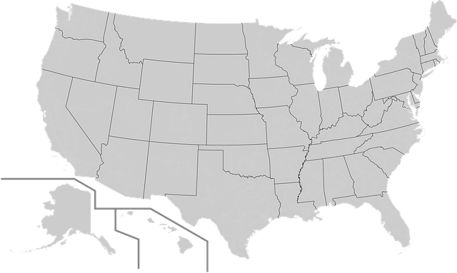

#### Split Your Soul to Model Your Domain

Dave Rael

[http://developeronfire.com](http://developeronfire.com)
[https://members.developeronfire.com](https://members.developeronfire.com)

dave@raelyard.com
https://github.com/raelyard/ManyModels

### Experiment

### How Humans Connect

Note:
Humans learn best from stories

### Coding Horror Wisdom

Note:
You shouldn't be on the internet to change peoples' minds about a topic. I think if you set out with the idea that I'm gonna change peoples' minds about x, you will fail, and you will always fail because people hate to have their minds changed.
... That sounds really depressing, but it isn't because I'm going to tell you what the secret is. The secret to changing peoples' minds is to tell a really good story.
... Helping people understand the complexity of the problem and appreciating others peoples' perspectives is just simple story telling.

### Common Themes

### Humble Beginnings

### Call To Adventure

### Transformation

### Return

### Immortality

### We Are Vulnerable

#### A Masterfully Told Tale

Note:
An author from the UK

#### Dealing with the Problem of Mortality

#### One Database to Rule Them All

#### One Database to Rule Them All

Note:
Lead into next slide with "And what's the result of this?"

#### Pain

#### Bounded Contexts

Note:
Lead in to next slide:
I can think of a model of this...

#### Sovereign, Independent, and Free-Standing

#### Pain

### Split Your Soul to Model Your Domain

Dave Rael

[http://developeronfire.com](http://developeronfire.com)
[https://members.developeronfire.com](https://members.developeronfire.com)

dave@raelyard.com
https://github.com/raelyard/ManyModels
